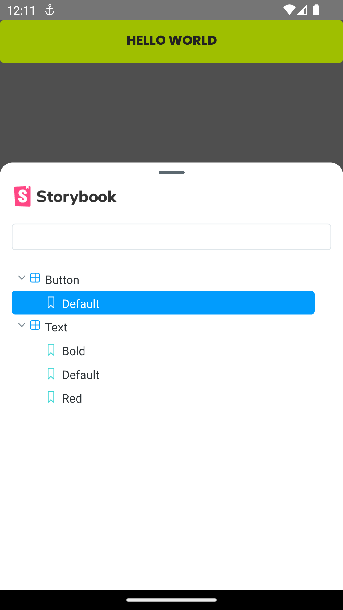

# angra2go

### configs ambiente para rodar o app:
- `node >= 18`
- `java >= 17`
- `Android SDK Platform >= 34`

### commands used and tutorials:
- `npx @react-native-community/cli@latest init Angra2GoApp`
- `https://github.com/storybookjs/react-native/blob/next/MANUAL_SETUP.md`

### techs:
- formik & yup
- zustand
- styled-components
- axios
- react-query
- i18n
- husky
- react native navigation
- storybook

### upgrades [link helper upgrade rn](https://react-native-community.github.io/upgrade-helper):
- 0.75.4 -> 0.76.6
