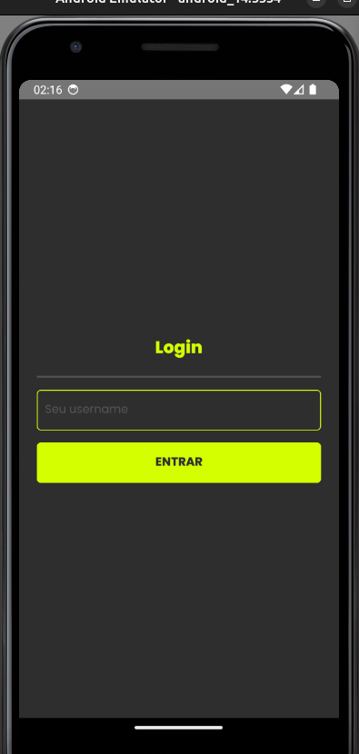

# angra2go

### configs ambiente para rodar o app:
- `node >= 18`
- `java >= 17`
- `Android SDK Platform >= 34`

### comando usado para gerar o app:
`npx @react-native-community/cli@latest init Angra2GoApp`

### techs:
- formik & yup
- zustand
- styled-components
- axios
- i18n
- husky
- react native navigation

